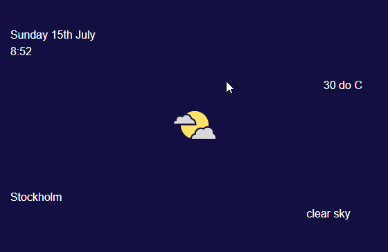

# Tasks
The following tasks must be completed:
* [x] Responsive for any screen (desktop, laptop, tablet, phone)
* [x] Uses only Grid for main layout
* [x] Uses flexbox for positioning inside grid-items
* [x] All colors are used through CSS Variables
* [x] Deploy website to Netlify: https://eloquent-sammet-a23697.netlify.com/

# Bonus tasks:
The following tasks are bonus tasks:
* [x] Retrieve data from the external api service (http://api.openweathermap.org/data/2.5/find?q=Stockholm&units=metric&appid=dfe15a41201d660911d013203832e676) and display it.
* [ ] Add one more row in the grid and make navigation: Stockholm, Hanoi, Paris, London, Beijing. Can you display their weather as well?